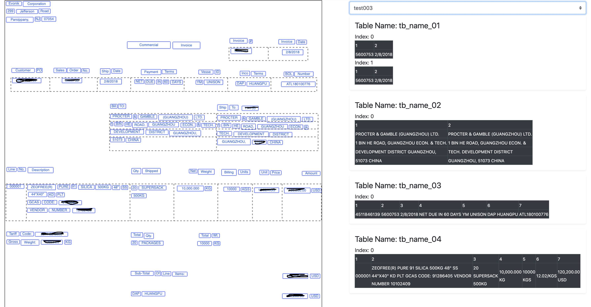

# NWCD-Industry-Customized-OCR-Solution

# 免责说明
建议测试过程中使用此方案，生产环境使用请自行考虑评估。
当您对方案需要进一步的沟通和反馈后，可以联系 nwcd_labs@nwcdcloud.cn 获得更进一步的支持。
欢迎联系参与方案共建和提交方案需求, 也欢迎在 github 项目issue中留言反馈bugs。


#  项目说明
使用Sagemaker 实现中文ocr模型的训练，并部署为Web服务， 提供文本识别功能。 


通过AWS Textract 或者自己训练的中文OCR模型 对图像进行ocr识别， 返回json格式的数据文件， 返回的数据包含了文本块的坐标，内容，置信度等信息。


---------------------------------
# 使用Sagemaker 训练中文OCR 模型


### 训练

[sagemaker/01-train/train.ipynb](./sagemaker/01-train/train.ipynb)


## 部署

[sagemaker/02-inference/inference.ipynb](./sagemaker/02-inference/inference.ipynb)


---------------------------------
# 本地环境 训练中文OCR 模型

### 测试

```
conda create -n  ocr python=3.6
source activate ocr
pip install -r requirements.txt -i https://mirrors.163.com/pypi/simple/ 


cd shell
sh chinese_ocr.sh

```


### 训练

需要准备训练数据， 请参考[ocr-text-renderer 中文文字图片生成](https://github.com/dikers/ocr-text-renderer)


```
cd local/data_generate/
sh create_lmdb.sh

cd ../atte
sh run.sh

```


-------------------------------
# 模板识别工具


业务系统需要解析这些内容，保存到业务系统中。 不同文件需要提取的内容不同， 直接使用Textract 比较难满足特定需求。 所以开发了一组功能来解决这个问题。
首先通过UI界面对模板进行设置，用户通过简单的点击，填写信息，生成模板内容， 后续相同类型的图像文件，会自动进行识别。


## 架构图 


## 识别的图像Demo


## UI截图

### 横向表格如下：  


### 纵向表格如下：  


## 图片进行ocr识别脚本


```shell script
cd shell
sh chinese_ocr.sh     #中文识别

sh english_ocr.sh     #英文识别

```